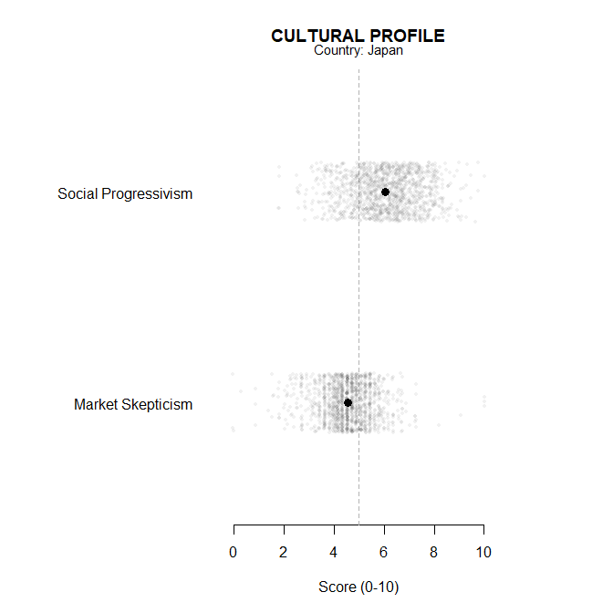
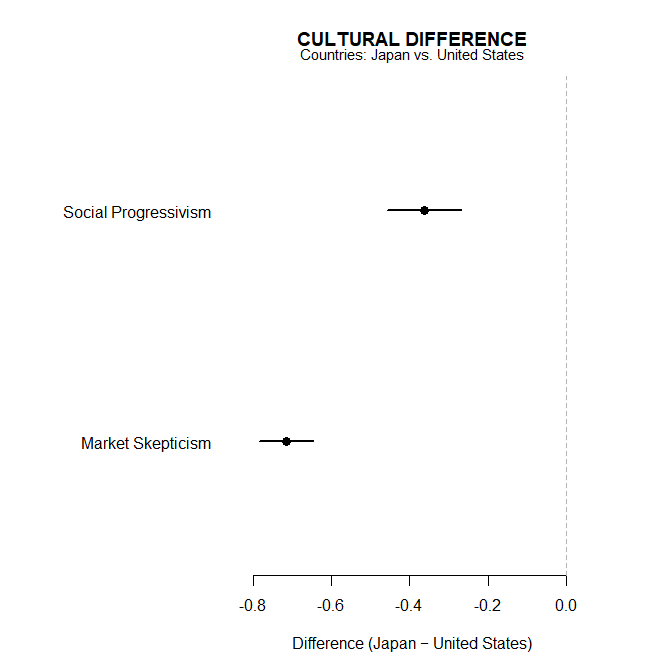
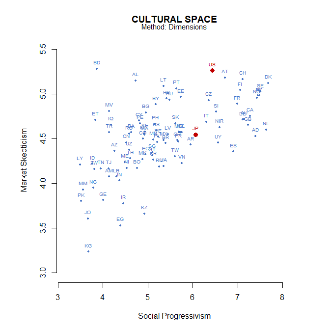

# [`wvsR`](https://github.com/cwendorf/wvsR/)

## Custom Dimensions

This page shows how to define custom dimensions and use them with the
same profile and comparison functions as the default EVS/WVS set.

- [Define A Dimension Set](#define-a-dimension-set)
- [Validate The Variables](#validate-the-variables)
- [Use The Custom Set](#use-the-custom-set)

------------------------------------------------------------------------

### Define A Dimension Set

A dimension set is a named list. Each dimension has a label and a type.
The items are specified as a character vector of variable names - the
codebook automatically fills in the response ranges and directions for
you.

``` r
dims_custom <- list(
  SocialProgressivism = list(
    label = "Social Progressivism",
    type = "mean",
    items = c("F118", "F119", "F120", "F121", "F122", "D059", "G052")
  ),
  MarketSkepticism = list(
    label = "Market Skepticism",
    type = "mean",
    items = c("E035", "E036", "E037", "E039", "E033")
  )
)
```

### Validate The Variables

List the items used in each custom dimension so you can verify labels
and ranges before using the custom dimensions.

``` r
wvs_items(
  vars = c("F118", "F119", "F120", "F121", "F122", "D059", "G052")
)
```

                                                                          label
    D059                        Men make better political leaders than women do
    F118                                             Justifiable: Homosexuality
    F119                                              Justifiable: Prostitution
    F120                                                  Justifiable: Abortion
    F121                                                   Justifiable: Divorce
    F122                                                Justifiable: Euthanasia
    G052 Evaluate the impact of immigrants on the development of [your country]
                       group direction min max
    D059              Family         1  -1   4
    F118 Religion and morale         1  -1  10
    F119 Religion and morale         1  -1  10
    F120 Religion and morale         1  -1  10
    F121 Religion and morale         1  -1  10
    F122 Religion and morale         1  -1  10
    G052   National identity         1  -1   5

``` r
wvs_items(
  vars = c("E035", "E036", "E037", "E039", "E033")
)
```

                                          label                group direction min
    E033    Self positioning in political scale Politics and society         1  -1
    E035                        Income equality Politics and society        -1  -1
    E036 Private vs state ownership of business Politics and society        -1  -1
    E037              Government responsibility Politics and society        -1  -1
    E039            Competition good or harmful Politics and society        -1  -1
         max
    E033  10
    E035  10
    E036  10
    E037  10
    E039  10

### Use The Custom Set

Profile a single country using the custom dimensions and plot the
result:

``` r
wvs_profile(
  "JP", 
  dimensions = dims_custom
) |> plot()
```

<!-- -->

Compare two countries on the custom dimensions and plot their
differences:

``` r
wvs_difference(
  countries = c("JP", "US"), 
  dimensions = dims_custom
) |> plot()
```

<!-- -->

Project countries into the two-dimensional space defined by the selected
custom dimensions and highlight the US and JP:

``` r
wvs_space(
  method="dimensions", 
  dimensions = dims_custom, 
  select=c("SocialProgressivism", "MarketSkepticism"),
) |> plot(highlight=c("US", "JP"))
```

<!-- -->
