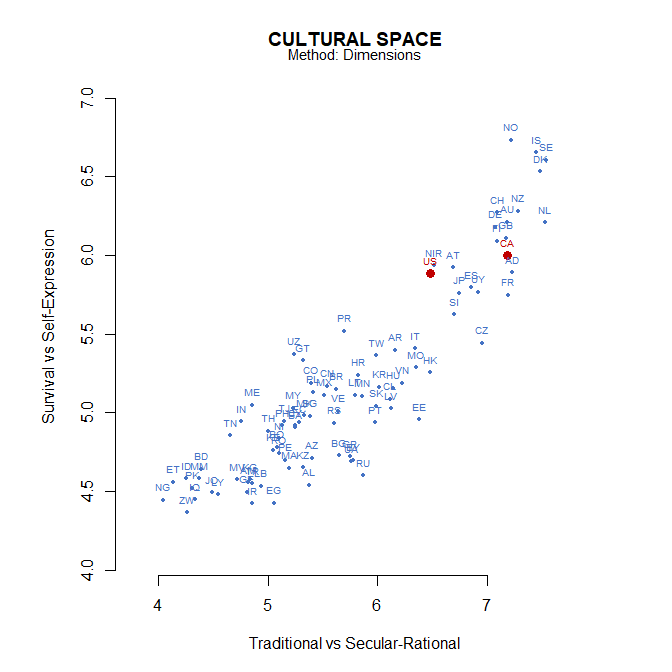
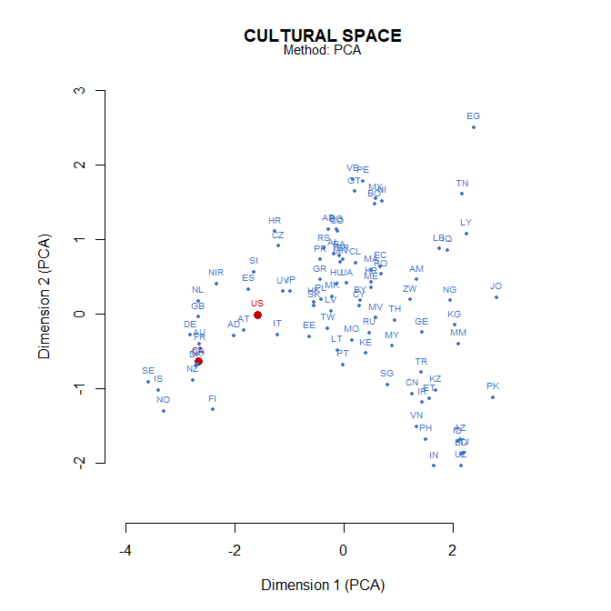
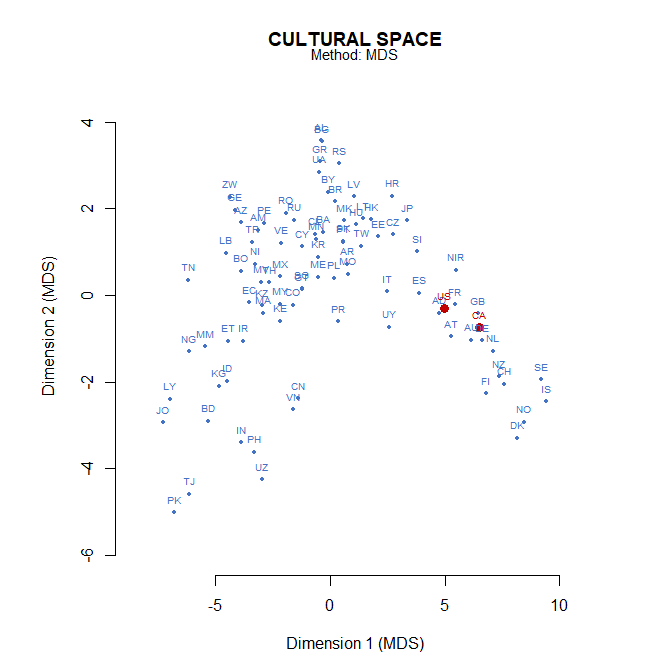

# [`wvsR`](https://github.com/cwendorf/wvsR/)

## Cultural Distances

`wvsR` includes tools for visualising cultural differences across
countries. These can be used to explore the relationships between
dimensions, identify clusters of similar cultures, and highlight
specific countries of interest.

------------------------------------------------------------------------

## Mapping Countries

`wvs_space()` will provide coordinates for countries directly on two
named dimensions.

``` r
wvs_space(
  method = "dimensions",
  select = c("Tradition", "Survival")
)
```


    CULTURAL SPACE
    Method: Dimensions

       ISO          Country Tradition Survival
    1   AD          Andorra     7.231    5.891
    2   AL          Albania     5.376    4.540
    3   AM          Armenia     4.819    4.556
    4   AR        Argentina     6.160    5.399
    5   AT          Austria     6.697    5.922
    6   AU        Australia     7.189    6.213
    7   AZ       Azerbaijan     5.409    4.713
    8   BA           Bosnia     5.250    4.905
    9   BD       Bangladesh     4.394    4.640
    10  BG         Bulgaria     5.648    4.726
    11  BO          Bolivia     5.081    4.780
    12  BR           Brazil     5.620    5.150
    13  BY          Belarus     5.778    4.697
    14  CA           Canada     7.183    5.998
    15  CH      Switzerland     7.094    6.272
    16  CL            Chile     6.116    5.086
    17  CN            China     5.537    5.169
    18  CO         Colombia     5.392    5.188
    19  CY           Cyprus     5.246    4.918
    20  CZ   Czech Republic     6.958    5.443
    21  DE          Germany     7.076    6.180
    22  DK          Denmark     7.490    6.534
    23  EC          Ecuador     5.285    4.940
    24  EE          Estonia     6.386    4.956
    25  EG            Egypt     5.060    4.427
    26  ES            Spain     6.861    5.795
    27  ET         Ethiopia     4.135    4.559
    28  FI          Finland     7.095    6.091
    29  FR           France     7.193    5.749
    30  GB    Great Britain     7.175    6.109
    31  GE          Georgia     4.812    4.496
    32  GR           Greece     5.755    4.722
    33  GT        Guatemala     5.327    5.330
    34  HK        Hong Kong     6.481    5.255
    35  HR          Croatia     5.829    5.240
    36  HU          Hungary     6.145    5.157
    37  ID        Indonesia     4.252    4.580
    38  IN            India     4.752    4.944
    39  IQ             Iraq     4.334    4.448
    40  IR             Iran     4.859    4.422
    41  IS          Iceland     7.447    6.653
    42  IT            Italy     6.343    5.407
    43  JO           Jordan     4.493    4.493
    44  JP            Japan     6.745    5.759
    45  KE            Kenya     5.046    4.761
    46  KG       Kyrgyzstan     4.835    4.575
    47  KR            Korea     6.017    5.163
    48  KZ       Kazakhstan     5.325    4.650
    49  LB          Lebanon     4.943    4.533
    50  LT        Lithuania     5.801    5.110
    51  LV           Latvia     6.124    5.027
    52  LY            Libya     4.543    4.480
    53  MA          Morocco     5.197    4.648
    54  ME       Montenegro     4.854    5.049
    55  MK  North Macedonia     5.332    4.981
    56  MM          Myanmar     4.368    4.580
    57  MN         Mongolia     5.865    5.107
    58  MO            Macau     6.356    5.287
    59  MV         Maldives     4.723    4.575
    60  MX           Mexico     5.511    5.111
    61  MY         Malaysia     5.228    5.031
    62  NG          Nigeria     4.045    4.444
    63  NI        Nicaragua     5.105    4.835
    64 NIR Northern Ireland     6.516    5.934
    65  NL      Netherlands     7.538    6.210
    66  NO           Norway     7.220    6.735
    67  NZ      New Zealand     7.291    6.281
    68  PE             Peru     5.155    4.698
    69  PH      Philippines     5.133    4.917
    70  PK         Pakistan     4.309    4.522
    71  PL           Poland     5.418    5.131
    72  PR      Puerto Rico     5.700    5.519
    73  PT         Portugal     5.980    4.936
    74  RO          Romania     5.099    4.741
    75  RS           Serbia     5.601    4.934
    76  RU           Russia     5.873    4.600
    77  SE           Sweden     7.545    6.606
    78  SG        Singapore     5.387    4.977
    79  SI         Slovenia     6.703    5.624
    80  SK         Slovakia     5.993    5.043
    81  TH         Thailand     5.003    4.884
    82  TJ       Tajikistan     5.146    4.948
    83  TN          Tunisia     4.651    4.854
    84  TR           Turkey     4.856    4.549
    85  TW           Taiwan     5.990    5.362
    86  UA          Ukraine     5.757    4.688
    87  US    United States     6.480    5.885
    88  UY          Uruguay     6.923    5.767
    89  UZ       Uzbekistan     5.241    5.372
    90  VE        Venezuela     5.641    5.011
    91  VN          Vietnam     6.229    5.189
    92  ZW         Zimbabwe     4.261    4.365

Follow with a plot call to visualize the results. It can highlight
specific countries.

``` r
wvs_space(
  method = "dimensions",
  select = c("Tradition", "Survival")
) |> plot(highlight = c("US", "CA"))
```

<!-- -->

It can also reduce a larger selected dimension space with PCA or MDS.

``` r
wvs_space(
  method = "pca",
  dimensions = dims_main
) |> plot(highlight = c("US", "CA"))
```

<!-- -->

``` r
wvs_space(
  method = "mds",
  dimensions = dims_all
) |> plot(highlight = c("US", "CA"))
```

<!-- -->

## Similar Countries

`wvs_neighbors()` ranks countries by Euclidean distance across the
selected dimension means.

``` r
wvs_neighbors(
  "US",
  n = 5,
  dimensions = dims_main
)
```


    CULTURAL NEIGHBORS
    Country: United States

      ISO   Country Distance
    1  IT     Italy    0.719
    2  AT   Austria    0.809
    3  JP     Japan    1.151
    4  FR    France    1.171
    5  AU Australia    1.272

It can also be used to find the most similar countries on a single
dimension.

``` r
wvs_neighbors(
  "US",
  n = 10,
  select = c("Economic")
)
```


    CULTURAL NEIGHBORS
    Country: United States

       ISO     Country Distance
    1   AT     Austria    0.183
    2   AL     Albania    0.280
    3   CH Switzerland    0.304
    4   PT    Portugal    0.395
    5   DK     Denmark    0.418
    6   LT   Lithuania    0.615
    7   SE      Sweden    0.774
    8   IS     Iceland    0.788
    9   HR     Croatia    0.827
    10  EE     Estonia    0.843

## Clustering Countries

`wvs_clusters()` applies k-means clustering to the selected country mean
profiles.

``` r
wvs_clusters(
  k = 4,
  dimensions = dims_main
)
```


    CULTURAL CLUSTERS
    Clusters: 4

    Country Assignments

       ISO          Country Cluster
    7   AZ       Azerbaijan   1.000
    9   BD       Bangladesh   1.000
    17  CN            China   1.000
    27  ET         Ethiopia   1.000
    31  GE          Georgia   1.000
    37  ID        Indonesia   1.000
    38  IN            India   1.000
    40  IR             Iran   1.000
    46  KG       Kyrgyzstan   1.000
    48  KZ       Kazakhstan   1.000
    56  MM          Myanmar   1.000
    61  MY         Malaysia   1.000
    69  PH      Philippines   1.000
    70  PK         Pakistan   1.000
    78  SG        Singapore   1.000
    82  TJ       Tajikistan   1.000
    84  TR           Turkey   1.000
    89  UZ       Uzbekistan   1.000
    91  VN          Vietnam   1.000
    1   AD          Andorra   2.000
    5   AT          Austria   2.000
    6   AU        Australia   2.000
    14  CA           Canada   2.000
    15  CH      Switzerland   2.000
    21  DE          Germany   2.000
    22  DK          Denmark   2.000
    26  ES            Spain   2.000
    28  FI          Finland   2.000
    29  FR           France   2.000
    30  GB    Great Britain   2.000
    41  IS          Iceland   2.000
    42  IT            Italy   2.000
    64 NIR Northern Ireland   2.000
    65  NL      Netherlands   2.000
    66  NO           Norway   2.000
    67  NZ      New Zealand   2.000
    77  SE           Sweden   2.000
    79  SI         Slovenia   2.000
    87  US    United States   2.000
    3   AM          Armenia   3.000
    25  EG            Egypt   3.000
    39  IQ             Iraq   3.000
    43  JO           Jordan   3.000
    49  LB          Lebanon   3.000
    52  LY            Libya   3.000
    62  NG          Nigeria   3.000
    83  TN          Tunisia   3.000
    2   AL          Albania   4.000
    4   AR        Argentina   4.000
    8   BA           Bosnia   4.000
    10  BG         Bulgaria   4.000
    11  BO          Bolivia   4.000
    12  BR           Brazil   4.000
    13  BY          Belarus   4.000
    16  CL            Chile   4.000
    18  CO         Colombia   4.000
    19  CY           Cyprus   4.000
    20  CZ   Czech Republic   4.000
    23  EC          Ecuador   4.000
    24  EE          Estonia   4.000
    32  GR           Greece   4.000
    33  GT        Guatemala   4.000
    34  HK        Hong Kong   4.000
    35  HR          Croatia   4.000
    36  HU          Hungary   4.000
    44  JP            Japan   4.000
    45  KE            Kenya   4.000
    47  KR            Korea   4.000
    50  LT        Lithuania   4.000
    51  LV           Latvia   4.000
    53  MA          Morocco   4.000
    54  ME       Montenegro   4.000
    55  MK  North Macedonia   4.000
    57  MN         Mongolia   4.000
    58  MO            Macau   4.000
    59  MV         Maldives   4.000
    60  MX           Mexico   4.000
    63  NI        Nicaragua   4.000
    68  PE             Peru   4.000
    71  PL           Poland   4.000
    72  PR      Puerto Rico   4.000
    73  PT         Portugal   4.000
    74  RO          Romania   4.000
    75  RS           Serbia   4.000
    76  RU           Russia   4.000
    80  SK         Slovakia   4.000
    81  TH         Thailand   4.000
    85  TW           Taiwan   4.000
    86  UA          Ukraine   4.000
    88  UY          Uruguay   4.000
    90  VE        Venezuela   4.000
    92  ZW         Zimbabwe   4.000

    Cluster Centers

      Cluster Institution Moral Gender Civic
    1   1.000       4.475 3.274  6.061 3.118
    2   2.000       3.932 6.389  7.103 4.201
    3   3.000       3.797 2.913  5.650 2.992
    4   4.000       3.806 4.258  6.484 3.433
