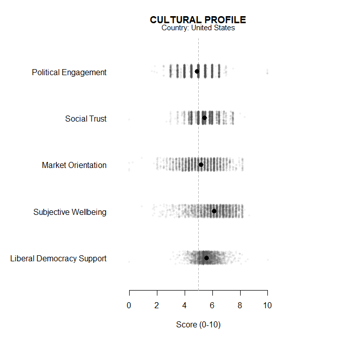
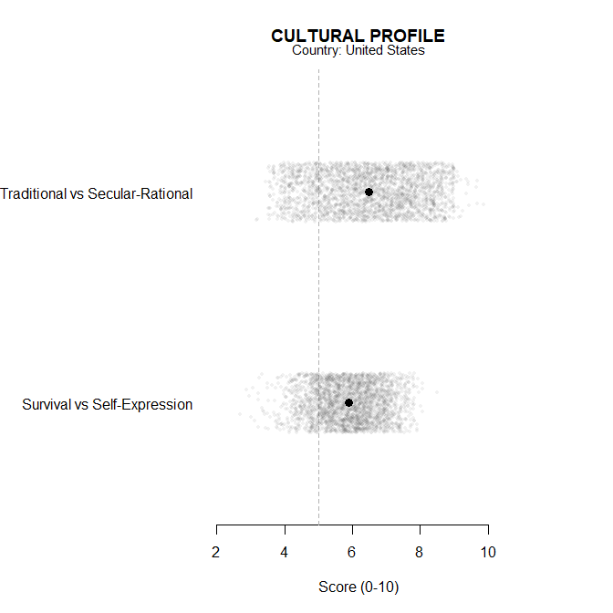
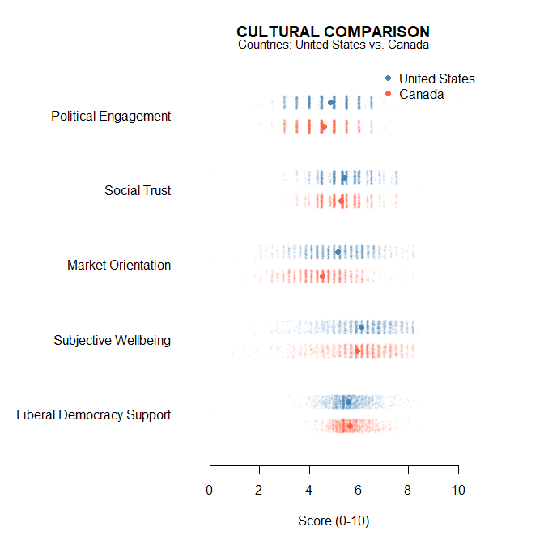
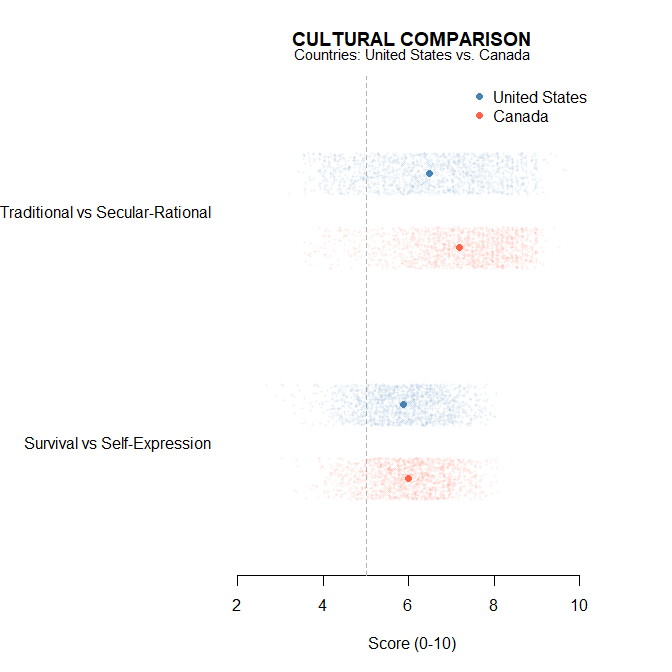
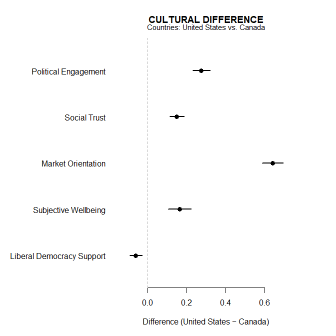
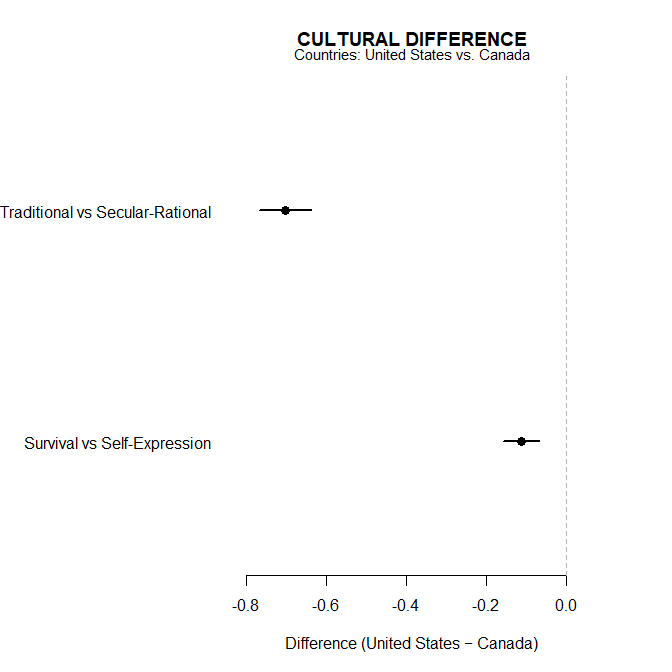

# [`wvsR`](https://github.com/cwendorf/wvsR/)

## Cultural Estimates

Most cross-cultural tools report just country scores and leave the user
to judge whether the scores differ meaningfully. `wvsR` takes a
different approach, providing confidence intervals and effect sizes
where appropriate.

- [Country Profiles](#country-profiles)
- [Country Comparisons](#country-comparisons)
- [Country Differences](#country-differences)

------------------------------------------------------------------------

### Country Profiles

`wvs_profile()` estimates each selected dimension for one country and
returns the mean, confidence interval, and valid respondent count.

``` r
wvs_profile(
  "US",
  dimensions = dims_extended
)
```


    CULTURAL PROFILE
    Country: United States

      Dimension  Mean    LL    UL    N
    1 Political 4.871 4.821 4.921 2587
    2    Social 5.428 5.388 5.468 2592
    3  Economic 5.163 5.103 5.222 2586
    4 Wellbeing 6.113 6.053 6.173 2592
    5 Democracy 5.576 5.542 5.610 2573

Follow with a plot call to visualize the results. Its default plot
overlays respondent-level jittered scores. (The confidence intervals are
not shown in the plot because they are often too small to see.)

``` r
wvs_profile(
  "US",
  dimensions = dims_extended
) |> plot()
```

<!-- -->

The same function can use specified dimensions instead.

``` r
wvs_profile(
  "US",
  select = c("Tradition", "Survival")
) |> plot()
```

<!-- -->

### Country Comparisons

Use `wvs_compare()` to prepare mean tables separately for the two
countries.

``` r
wvs_compare(
  countries = c("US", "CA"),
  dimensions = dims_extended
)
```


    CULTURAL COMPARISON
    Countries: United States vs. Canada

    United States

      Dimension  Mean    LL    UL    N
    1 Political 4.871 4.833 4.909 2587
    2    Social 5.428 5.398 5.458 2592
    3  Economic 5.163 5.118 5.208 2586
    4 Wellbeing 6.113 6.068 6.158 2592
    5 Democracy 5.576 5.550 5.602 2573

    Canada

      Dimension  Mean    LL    UL    N
    1 Political 4.595 4.570 4.620 4018
    2    Social 5.278 5.257 5.300 4018
    3  Economic 4.523 4.492 4.553 4018
    4 Wellbeing 5.949 5.913 5.985 4018
    5 Democracy 5.636 5.618 5.655 4018

Follow with a plot call to visualize the results. Its default plot
overlays respondent-level jittered scores. (The confidence intervals are
not shown in the plot because they are often too small to see.)

``` r
wvs_compare(
  countries = c("US", "CA"),
  dimensions = dims_extended
) |> plot()
```

<!-- -->

The same function can use specified dimensions instead.

``` r
wvs_compare(
  countries = c("US", "CA"),
  select = c("Tradition", "Survival")
) |> plot()
```

<!-- -->

### Country Differences

`wvs_difference()` estimates the difference between countries on each
selected dimension. Positive values mean the first country scored
higher.

``` r
wvs_difference(
  countries = c("US", "CA"),
  dimensions = dims_core
)
```


    CULTURAL DIFFERENCE
    Countries: United States vs. Canada

      Dimension   Diff     LL     UL      d
    1 Tradition -0.704 -0.769 -0.639 -0.554
    2  Survival -0.113 -0.158 -0.068 -0.126

Follow with a plot call to visualize the results. Its default plot adds
confidence intervals to the mean difference.

``` r
wvs_difference(
  countries = c("US", "CA"),
  dimensions = dims_extended
) |> plot()
```

<!-- -->

The same function can use specified dimensions instead.

``` r
wvs_difference(
  countries = c("US", "CA"),
  select = c("Tradition", "Survival")
) |> plot()
```

<!-- -->
